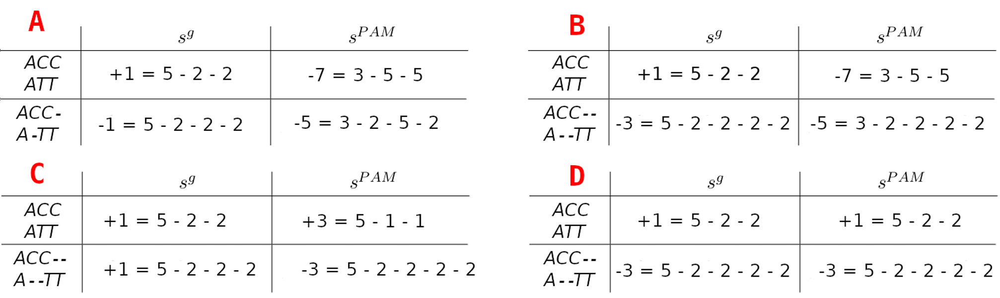

---------------------------------

# Exercise 1 - Point Accepted Mutation (PAM)

We want to calculate the $PAM_1$ matrix based on the following two sequence alignments of the DNA sequences a, b, c and d.


```
a = AAGTACTTT   c = AGGTAACACGTTTAGTCA
b = AAATTCCTA   d = AGTTTACCGGGTTAATCA
```

Tip: In order to solve a) and b) create a combined alignment comprised of two combined sequences a' and b' (based on the two initial alignments and their symmetric counterparts)

a' = a + c + b + d

b' = b + d + a + c

The order does not matter, as the frequency identification is position-insensitive.

Unless otherwise stated round all results to 4 decimal places.


### 1a)

Calculate the nucleotide frequencies  $r_x$


#### {.tabset }

##### Hide

##### Hint : Formulae

\[
r_x = \frac{\#\{x \in (a')\}}{\lvert a' \rvert}
\]

##### Solution
\begin{align}
  r_A = 0.3333 \\
  r_C = 0.1667 \\
  r_T = 0.3333 \\
  r_G = 0.1667 \\
\end{align}


#### {-}

### 1b)

Calculate the symmetric mutation matrix $E(x,y)$.

#### {.tabset}

##### Hide


##### Hint : Formulae

\[
e_{xy} = \frac{1}{\lvert a' \rvert} \left( \# \left\{ \frac{x}{y} \in (a') \right\} \in (b') \right)
\]  
  

##### Intermediate Values

Non normalized values. Further multiplied by $|a'|$

```{r, include=FALSE}
sij <- read.csv("tables/sheet-8/b_1.csv", check.names=FALSE, sep=",")
```

```{r, results="asis", include=knitr::is_html_output(), echo=FALSE}
sij_ft <- flextable(sij)
sij_ft <- custom_theme(sij_ft)
index_replace(sij_ft)
```

##### Solution


```{r, include=FALSE}
sij <- read.csv("tables/sheet-8/b_1_final.csv", check.names=FALSE, sep=",")
```

```{r, results="asis", include=knitr::is_html_output(), echo=FALSE}
sij_ft <- flextable(sij)
sij_ft <- custom_theme(sij_ft)
index_replace(sij_ft)
```


#### {-}

### 1c)

Calculate the non-normalized PAM matrix S with $10*log_{10} (odds)$, using the previously determined $r$ values and $E$ matrix. (round to integers)

#### {.tabset}

##### Hide

##### Hint : Formulae

\begin{align}
S_{xy} = 10 \log_{10} \left( \frac{e_{xy}}{r_x r_y} \right)
\end{align}
  


##### Solution

```{r, include=FALSE}
sij <- read.csv("tables/sheet-8/c_1.csv", check.names=FALSE, sep=",")
```

```{r, results="asis", include=knitr::is_html_output(), echo=FALSE}
sij_ft <- flextable(sij)
sij_ft <- custom_theme(sij_ft)
index_replace(sij_ft)
```

#### {-}


### 1d)

 Given the sequences $a = ACC$ and $b = ATT$, compute the optimal Needleman-Wunsch alignments using:
 
 1. The general similarity scoring function.
 
\[
s^{g}(x, y) =
\begin{cases}
5 & \text{if } x = y \\
-2 & \text{if } x \neq y \text{ or gapped}
\end{cases}
\]

2. The PAM1-based similarity scoring function.

\[
s^{PAM}(x, y) =
\begin{cases}
-2 & \text{if } x \text{ or } y \text{ gapped} \\
s_{x,y} & \text{otherwise (match/mismatch)}
\end{cases}
\]
 
#### {.tabset}


##### Hide

##### Hint: Possible Answers

::::{#img1-p .extra-m}
::: {#img3 .tutorial-img}
```{r, echo=FALSE, out.width="100%", fig.align='center', include=knitr::is_html_output()}

```
:::
::::

##### Solution

B

#### {-}

### 1e)

Calculate the normalization factor $\gamma$ based on $E$ .
 
#### {.tabset}


##### Hide

##### Hint: Formulae

\[
0.01 = \gamma \sum_{x \neq y} e_{xy} = \gamma \left(1 - \sum_{x} e_{xx}\right)
\]

##### Solution
\[
\gamma = 0.027
\]

#### {-}

### 1f)

Calculate the mutation rate matrix $P$.
 
#### {.tabset}


##### Hide

##### Hint: Formulae

\[
p_{xy} = \frac{e_{xy}}{r_x}
\]


##### Solution

```{r, include=FALSE}
sij <- read.csv("tables/sheet-8/f_1.csv", check.names=FALSE, sep=",")
```

```{r, results="asis", include=knitr::is_html_output(), echo=FALSE}
sij_ft <- flextable(sij)
sij_ft <- custom_theme(sij_ft)
index_replace(sij_ft)
```

#### {-}

### 1g)

Calculate the normalized mutation rate matrix $P'$ using $P$ and the normalization factor $\gamma$.
 
#### {.tabset}


##### Hide

##### Hint: Formulae

\begin{align*}
p'_{xy} &= \gamma p_{xy} \\
p'_{xx} &= 1 - \sum_{x \neq y} p'_{xy}
\end{align*}

##### Solution

```{r, include=FALSE}
sij <- read.csv("tables/sheet-8/g_1.csv", check.names=FALSE, sep=",")
```

```{r, results="asis", include=knitr::is_html_output(), echo=FALSE}
sij_ft <- flextable(sij)
sij_ft <- custom_theme(sij_ft)
index_replace(sij_ft)
```

#### {-}

### 1h)

Determine $PAM_1$ based on the normalized mutation rate matrix $P'$ with $10*log_{10}(odds)$ (round to integer)
 
#### {.tabset}


##### Hide

##### Hint: Formulae

\[
PAM1_{xy} = 10 \log_{10} \left(\frac{p'_{xy}}{r_y}\right)
\]

##### Solution

```{r, include=FALSE}
sij <- read.csv("tables/sheet-8/h_1.csv", check.names=FALSE, sep=",")
```

```{r, results="asis", include=knitr::is_html_output(), echo=FALSE}
sij_ft <- flextable(sij)
sij_ft <- custom_theme(sij_ft)
index_replace(sij_ft)
```

#### {-}


### 1i)

Determine $PAM_2$. (round to integer)

#### {.tabset}


##### Hide

##### Hint: Formulae

\[
PAM(m)_{xy} = 10 \log_{10} \left(\frac{p'_{xy}}{r_y}\right) \text{ with } p'_{xy} \in (P')^m
\]

##### Solution

```{r, include=FALSE}
sij <- read.csv("tables/sheet-8/i_1.csv", check.names=FALSE, sep=",")
```

```{r, results="asis", include=knitr::is_html_output(), echo=FALSE}
sij_ft <- flextable(sij)
sij_ft <- custom_theme(sij_ft)
index_replace(sij_ft)
```

#### {-}


# Exercise 2 - Programming assignment

Programming assignments are available via Github Classroom and contain automatic tests.

We recommend doing these assignments since they will help you to further understand this topic.

Access the Github Classroom link: [Programming Assignment: Sheet 08](https://classroom.github.com/a/NohnBhm8).


